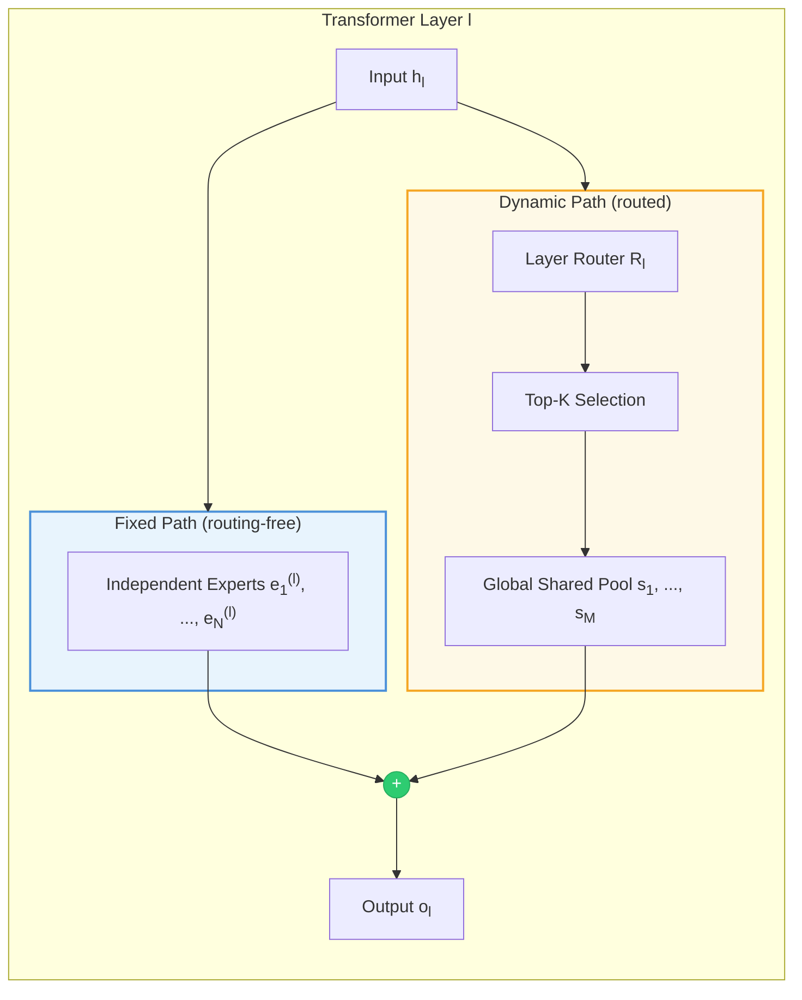

# CS-MoE: Improving Parameter Utilization by Sharing Neural Experts Across Layers in Transformers

<div align="left">

**Official repository** of the paper accepted to **EMNLP 2026 Main**.

[](https://arxiv.org/abs/2609.22199)
[](https://2026.emnlp.org/)
[](#license)

</div>

**Authors:** Dian Jiao\*, Jiaxin Duan\*, Shuai Zhao, Jiabing Leng, Yiran Zhang, Feng Huang
(\* equal contribution) — China Electronics Cloud Technology Co., Ltd.

## News

- **[2026-09]** Paper accepted to **EMNLP 2026 Main**.
- **[2026-09]** Reference implementation released under [`Qwen3-IMoE/`](./Qwen3-IMoE) (Transformers-based training & evaluation; see [Getting Started](#getting-started)).
- **[2026-08-31]** arXiv preprint released: [arXiv:2609.22199](https://arxiv.org/abs/2609.22199).
- **Checkpoints & Megatron-LM pipeline**: to be released (see [Release Plan](#release-plan)).

## TL;DR

Conventional Mixture-of-Experts (MoE) Transformers terminate every block with **layer-isolated experts**, so functional transformations are redundantly re-learned across network depth. **CS-MoE** removes this isolation with a **Global Experts Sharing** mechanism: each layer combines a routing-free **Fixed Path** (layer-private *Independent Experts*) with a **Dynamic Path** that routes per-token Top-K experts from one **centralized shared pool** accessible to *all* layers. Consequences:

1. **Parameter efficiency** — lower perplexity than equal-scale dense Transformers while activating only **55%** of parameters per forward pass (8B scale: PPL 9.55 vs. 9.75).
2. **Monotonic compute scaling** — performance improves consistently as the activated expert count K grows, with total parameters held fixed.
3. **A flexible Pareto frontier** — by enlarging the shared pool under a fixed FLOPs budget, CS-MoE matches or surpasses standard MoEs that consume more FLOPs (12B-A4B: PPL 9.19 vs. 9.40).

---

## Table of Contents

- [Motivation](#motivation)
- [Architecture](#architecture)
- [Results](#results)
  - [1. Parameter Expansion vs. Dense Baselines](#1-parameter-expansion-vs-dense-baselines)
  - [2. Dynamic Compute Allocation](#2-dynamic-compute-allocation)
  - [3. Convergence to Sparse MoE Baselines](#3-convergence-to-sparse-moe-baselines)
  - [4. Downstream Benchmarks](#4-downstream-benchmarks)
  - [5. Ablation Studies](#5-ablation-studies)
  - [6. Robustness, Latency, and Routing Dynamics](#6-robustness-latency-and-routing-dynamics)
- [Model Configurations](#model-configurations)
- [Training Setup](#training-setup)
- [Comparison with Related Approaches](#comparison-with-related-approaches)
- [Getting Started](#getting-started)
- [Repository Layout](#repository-layout)
- [Release Plan](#release-plan)
- [Citation](#citation)
- [License](#license)

---

## Motivation

Transformer-based LLMs suffer from **inter-layer parameter redundancy**: a substantial portion of FFN parameters contributes negligibly to the output for any given token, and conventional MoE designs prevent the network from exploiting functional recurrence across depths.

We quantify this redundancy with a pilot study on **Qwen3-MoE-4B** (36 layers, 4 experts/layer, Top-1). Using **Centered Kernel Alignment (CKA)** — which is invariant to orthogonal transformations and isotropic scaling — we greedily substitute deep-layer experts (layers 24–32) with their most CKA-similar shallow counterparts (layers 1–8) and measure perplexity change *without any fine-tuning*:

<div align="center">

<p><em>Figure 1: PPL of MoE models under targeted (CKA-guided) vs. random expert replacement.</em></p>
</div>

| Substitution type | Direction | +ΔPPL (ESR=5%) | +ΔPPL (ESR=20%) |
|---|:---:|:---:|:---:|
| **Targeted (CKA)** | Shallow → Deep | **+1.22** | **+3.45** |
| **Targeted (CKA)** | Deep → Shallow | **+1.54** | **+3.98** |
| Random swap | Shallow ↔ Deep | +4.20 | +12.80 |
| Random control | Arbitrary layers | +4.15 | +15.30 |

Targeted CKA substitution in **both directions** incurs far less degradation than random replacement — experts are largely interchangeable across depths. This motivates replacing per-layer expert isolation with longitudinal *reuse* through a shared pool.

---

## Architecture

<div align="center">

<p><em>Figure 2: Transformer architectures — Standard MoE (upper left), Dense (upper right), and CS-MoE (lower). The dashed box indicates a virtual router.</em></p>
</div>

The total expert set is partitioned into a **dual-tier topology**:

$$\mathcal{E}_{total}=\Big(\bigcup_{l=1}^{L}\mathcal{E}_{indep}^{(l)}\Big)\cup\mathcal{E}_{shared}$$

- **Fixed Path (routing-free).** Each layer $l$ activates its own $N_{indep}$ **Independent Experts** $\mathcal{E}_{indep}^{(l)}=\{e_1^{(l)},\dots,e_N^{(l)}\}$ unconditionally for every token, preserving depth-specific transformation capacity (e.g., hierarchical syntax) with zero routing overhead.
- **Dynamic Path (routed).** A **layer-specific router** $R_l$ selects $k$ experts per token from the global **Shared Expert Pool** $\mathcal{E}_{shared}=\{s_1,\dots,s_M\}$ — the same physical pool referenced by *every* layer, enabling extreme longitudinal parameter reuse.



**Routing.** The router computes scores over the shared pool and applies Top-K gating:

$$\mathbf{s}_l = W_{r,l}\,\mathbf{h}_l, \qquad \mathbf{g}_l = \text{Softmax}\big(\text{TopK}(\mathbf{s}_l, K)\big)$$

**Output aggregation.** The layer output sums both paths:

$$\mathbf{o}_l = \underbrace{\sum_{j=1}^{N_{indep}} \text{Expert}_{e,j}^{(l)}(\mathbf{h}_l)}_{\text{Fixed Path}} + \underbrace{\sum_{i \in \text{TopK}} g_{l,i} \cdot \text{Expert}_{s,i}(\mathbf{h}_l)}_{\text{Dynamic Path}}$$

Each layer therefore activates $N_{indep} + k$ experts per token ($k$ routed from the pool). Because the pool is universal, one shared expert may be activated by several layers simultaneously for the same or different tokens. Adjusting $K$ and $M$ decouples compute from capacity — breaking the linear relationship between model depth and parameter count.

**Layer-wise load balancing.** To prevent expert collapse of the shared pool, each layer applies an auxiliary balancing loss with coefficient $\alpha$:

$$\mathcal{L}_{aux}^{(l)} = M\sum_{i=1}^{M} f_{l,i} \cdot P_{l,i}, \qquad \mathcal{L}_{total} = \mathcal{L}_{LM} + \alpha\sum_{l=1}^{L}\mathcal{L}_{aux}^{(l)}$$

where $f_{l,i}$ is the fraction of batch tokens that selected shared expert $i$ at layer $l$ and $P_{l,i}$ the average routing probability assigned to it.

**Expert Utilization Ratio (EUR).** To measure parameter reuse we define

$$\rho=\frac{\big|\bigcup_{l=1}^{L}S_l\big|}{\min(M,\delta)}, \qquad \delta=\sum_{l=1}^{L}|S_l|$$

where $S_l$ is the set of shared experts activated at layer $l$.

---

## Results

### 1. Parameter Expansion vs. Dense Baselines

CS-MoE consistently achieves lower pre-training perplexity than Dense Transformers at every scale from 0.6B to 8B (Figures 3a–3d). The 8B CS-MoE model outperforms the fully-activated 8B Dense baseline while activating only **55%** of its physical parameters — cross-layer expert reuse expands effective representational capacity without increasing active FLOPs.

<div align="center">


<p><em>Figure 3: Training perplexity of CS-MoE vs. Dense at 0.6B / 1.7B / 4B / 8B scales.</em></p>
</div>

| Model scale | Dense baseline | CS-MoE (ours) | PPL reduction |
|:-----------:|:--------------:|:-------------:|:-------------:|
| 0.6B | 13.62 | **13.48** | 1.03% |
| 1.7B | 11.30 | **11.12** | 1.59% |
| 4B | 10.45 | **10.08** | 3.54% |
| 8B | 9.75 | **9.55** | 2.05% |

### 2. Dynamic Compute Allocation

With total parameters fixed, increasing the Top-K activation count yields **monotonic** perplexity reductions (e.g., 0.6B-A1.7B reaches 13.11 vs. 13.48 for 0.6B-A0.6B). Unlike rigid dense models, CS-MoE allows the FLOPs budget to be tuned at inference time via the routing budget into the shared pool.

<div align="center">


<p><em>Figure 4: CS-MoE with varying activation counts (A0.6B, A0.9B, A1.7B, ...).</em></p>
</div>

| Model scale | Activation config | Final PPL |
|:-----------:|:-----------------:|:---------:|
| 0.6B | 0.6B-A0.6B | 13.48 |
| 0.6B | 0.6B-A0.9B | 13.18 |
| 0.6B | 0.6B-A1.7B | **13.11** |
| 1.7B | 1.7B-A1.7B | 11.12 |
| 1.7B | 1.7B-A4B | **10.82** |
| 4B | 4B-A4B | 10.08 |
| 4B | 4B-A8B | **9.95** |

### 3. Convergence to Sparse MoE Baselines

Under strict alignment of both total parameters (HBM footprint) and active FLOPs, CS-MoE outperforms standard layer-isolated MoEs. Expanding the shared pool ($M$) drives EUR ($\rho$) toward 1.0, asymptotically recovering the capacity of standard MoEs while keeping FLOPs fixed.

<div align="center">


<p><em>Figure 5: CS-MoE vs. Standard MoE with equal total and activated parameters.</em></p>
</div>

| Configuration | Standard MoE | CS-MoE (ours) | PPL reduction |
|:-------------:|:------------:|:-------------:|:-------------:|
| 8B-A4B | 9.70 | **9.65** | 0.52% |
| 12B-A4B | 9.40 | **9.19** | 2.23% |

<div align="center">


<p><em>Figure 6: Expert Utilization Ratio increases with model scale and approaches ~1.0 at 4B activations.</em></p>
</div>

### 4. Downstream Benchmarks

**Short-run training (12,500 steps, WuDao + DCLM).** CS-MoE consistently surpasses the Dense baseline across scales and checkpoints; the advantage is largest under severe parameter constraints (0.6B: +4.4 C-Eval / +5.2 AQuA). CS-MoE also converges faster — matching or exceeding the Dense final score within 5,000–7,500 steps.

| Steps | 0.6B / -A0.9B (Dense → CS-MoE) | 1.7B / -A4B | 4B / -A8B |
|:-----:|:---:|:---:|:---:|
| **C-Eval** | | | |
| 2,500 | 28.2 → **31.5** | 30.1 → **31.7** | 29.3 → **29.8** |
| 7,500 | 35.1 → **39.3** | 36.4 → **40.1** | 35.6 → **41.0** |
| 12,500 | 37.5 → **41.9** | 38.6 → **42.3** | 40.7 → **43.2** |
| **AQuA** | | | |
| 2,500 | 22.4 → **26.1** | 21.8 → **28.5** | 27.2 → **33.6** |
| 7,500 | 29.1 → **34.0** | 29.8 → **34.3** | 36.1 → **37.2** |
| 12,500 | 31.2 → **36.4** | 32.6 → **37.8** | 39.1 → **40.5** |

**Full-scale pre-training (4.5T tokens, 8B scale, corpus expanded with Ultra FineWeb).** Steady convergence with zero expert collapse throughout the run.

| Benchmark | 8B Dense | 8B-A8B CS-MoE | Δ |
|---|:---:|:---:|:---:|
| BBH | 0.2867 | **0.7507** | +0.4640 |
| CMMLU | 0.7417 | **0.7942** | +0.0525 |
| ARC | 0.6875 | **0.7300** | +0.0425 |
| GSM8K | 0.9400 | **0.9450** | +0.0050 |
| C-Eval | 0.6996 | **0.7038** | +0.0042 |
| IFEval | **0.4300** | 0.4005 | −0.0295 |
| MATH | **0.7930** | 0.6660 | −0.1270 |

Minor trade-offs on Competition Math and IFEval stem from raw pre-training alignment sensitivity and are typically addressed during targeted supervised fine-tuning.

### 5. Ablation Studies

Ablations at strictly matched 4B parameters / 4B activations:

| Ablation setting | PPL ↓ | C-Eval ↑ | AQuA ↑ |
|---|:---:|:---:|:---:|
| **Independent expert allocation** | | | |
| $N_{indep}=0$ (shared pool only) | 10.32 | 41.8 | 39.5 |
| $N_{indep}=1$ (default) | **10.08** | **43.2** | **40.5** |
| $N_{indep}=2$ | 10.11 | 43.0 | 40.3 |
| **Router architecture** | | | |
| Centrally shared router | 10.29 | 41.9 | 39.6 |
| Layer-specific router (default) | **10.08** | **43.2** | **40.5** |
| **Load-balancing coefficient** | | | |
| $\alpha=0.0$ (collapse) | 10.35 | 41.4 | 39.2 |
| $\alpha=0.01$ (default) | **10.08** | **43.2** | **40.5** |
| $\alpha=0.1$ | 10.13 | 42.8 | 40.1 |
| $\alpha=0.5$ | 10.12 | 42.0 | 39.6 |
| **Cross-layer tying paradigm** | | | |
| Static tying (ALBERT-style) | 12.74 | 38.4 | 37.6 |
| Standard Dense (untied) | 10.45 | 40.7 | 39.1 |
| **CS-MoE dynamic sharing (ours)** | **10.08** | **43.2** | **40.5** |

Key takeaways: (i) at least one layer-private expert is essential for depth-specific features; (ii) different depths require customized gating — a globally shared router underperforms; (iii) $\alpha=0.01$ prevents collapse without over-constraining routing; (iv) dynamic routing-based sharing surpasses both rigid ALBERT-style tying and the untied Dense baseline.

### 6. Robustness, Latency, and Routing Dynamics

**Seed variance (3 runs, 4B scale, 12.5k steps).** Gains exceed standard deviations on all metrics:

| Model | Pre-train PPL | C-Eval (%) | AQuA (%) |
|---|:---:|:---:|:---:|
| 4B Dense | 10.25 ± 0.04 | 40.8 ± 0.3 | 39.0 ± 0.5 |
| 4B CS-MoE | **10.06 ± 0.03** | **42.3 ± 0.2** | **40.5 ± 0.4** |

**Inference latency (8B, 8×H200, batch size 1).** Routing costs <0.1% of forward FLOPs. With expert caching (adjacent layers access overlapping shared-expert subsets, enabling L2/SRAM retention), CS-MoE approaches Dense speed and outperforms standard MoE with a **45% reduction in unique memory traffic per token**:

| Model | Prefill (ms) | Decoding (ms/tok) |
|---|:---:|:---:|
| Dense 8B | 12.5 | 14.2 |
| Standard Sparse MoE 8B | 14.1 | 16.5 |
| CS-MoE 8B (default) | 13.8 | 15.8 |
| CS-MoE 8B (+ cache optimization) | **13.1** | **14.9** |

**Routing dynamics (8B model, 36 layers).** The overlap of top-10% most-activated shared experts between adjacent layers is 68.4%, decaying to 42.1% at layer distance 5 (smooth longitudinal semantic transitions); the average Gini coefficient of expert activation is 0.28, confirming global (not depth-confined) expert usage.

---

## Model Configurations

All models build on the [Qwen3](https://arxiv.org/abs/2505.09388) backbone (GQA, SwiGLU, RoPE). $d_{exp}$ is the per-expert FFN width; the shared pool $M$ grows while per-expert width stays at $d_{ffn}/4$.

| Model | Total Params | Activated Params | Layers | $d_{ffn}$ | $d_{exp}$ | $N_{indep}$ | Shared Pool ($M$) | Top-$K$* |
|---|:---:|:---:|:---:|:---:|:---:|:---:|:---:|:---:|
| Dense (baselines) | 0.6B / 1.7B / 4B / 8B | Same | 16–36 | 3,072–12,288 | – | – | – | – |
| CS-MoE 0.6B | 0.6B | 0.6B / 0.9B / 1.7B | 28 | 3,072 | 768 | 1 | 84 | 4 / 10 / 21 |
| CS-MoE 1.7B | 1.7B | 1.7B / 4B | 28 | 6,144 | 1,536 | 1 | 84 | 4 / 13 |
| CS-MoE 4B | 4B | 4B / 8B | 36 | 9,728 | 2,432 | 1 | 108 | 4 / 10 |
| CS-MoE 8B (A4B) | 8B | 4B | 36 | 9,728 | 2,432 | 1 | 324 | 4 |
| CS-MoE 8B (A8B) | 8B | 8B | 36 | 12,288 | 3,072 | 1 | 324 | 4 |
| CS-MoE 12B | 12B | 4B | 36 | 9,728 | 2,432 | 1 | 540 | 4 |

\* Top-$K$ counts **all** experts activated per token per layer, including the $N_{indep}=1$ independent expert — i.e., $K-1$ experts are routed from the shared pool. We adopt the naming convention `CS-MoE {Total}B-A{Activated}B`, e.g., *8B-A4B*.

---

## Training Setup

| Hyperparameter | Setting |
|---|---|
| Optimizer | AdamW ($\beta_1=0.9$, $\beta_2=0.95$, $\epsilon=1\text{e-}8$) |
| Peak learning rate | 3e-4 |
| Weight decay | 0.01 |
| Batch size | 512 sequences (~1M effective tokens) |
| Warmup steps | 1,000 |
| Total steps | 12,500 (base runs) / 4.5T tokens (scaled run) |
| LR schedule | Cosine annealing to $0.1\times\text{LR}_{\max}$ |
| Context length | 2,048 |
| Load-balancing $\alpha$ | 0.01 |

- **Base runs:** 8× NVIDIA H200 (141GB HBM3e) node, customized [Megatron-LM](https://github.com/NVIDIA/Megatron-LM), corpus = [WuDao](https://doi.org/10.1016/j.aiopen.2021.02.008) + [DCLM](https://arxiv.org/abs/2406.11794).
- **Scaled run (8B, 4.5T tokens):** gradient accumulation scaled across 32 nodes with identical LR schedules, corpus expanded with [Ultra FineWeb](https://arxiv.org/abs/2505.05427).

---

## Comparison with Related Approaches

| Approach | Sharing type | Per-token dynamic? | Inter-layer? |
|---|---|:---:|:---:|
| ALBERT | Uniform all-layer tying | ✗ | ✓ (rigid) |
| Universal Transformers | Recurrent single-layer | Partial | ✓ (sequential) |
| DeepSeek-MoE | Intra-layer shared experts | ✓ | ✗ |
| **CS-MoE** | **Inter-layer shared pool** | **✓** | **✓ (flexible)** |

CS-MoE uniquely combines per-token dynamic routing with genuine inter-layer sharing: depth-specific specialization via independent experts, cross-layer functional reuse via the shared pool.

---

## Getting Started

The reference implementation lives in [`Qwen3-IMoE/`](./Qwen3-IMoE) — a HuggingFace
Transformers drop-in on the Qwen3-MoE backbone. See its
[README](./Qwen3-IMoE/README.md) for full documentation.

```bash
cd Qwen3-IMoE
pip install -r requirements.txt

# Sanity check: build a model from a config, forward pass, report physical vs.
# activated parameter counts
python modeling_qwen3_imoe.py --config configs/qwen3_0_6_A0_6b.json

# Pre-train CS-MoE (single node)
TRAIN_DATA="data/train/*.parquet" bash scripts/pretrain_imoe.sh

# Downstream evaluation with inline accuracy scoring
python evaluate.py --model_type imoe --run_name qwen-imoe-0.6b-sft \
    --checkpoint_path outputs --data_dir data --ds_name aqua --num_samples 200
```

## Repository Layout

```
Self-MoE/
├── README.md                      # this file
├── figures/
│   ├── moe_merged.png             # Figure 2: architecture comparison
│   ├── exp_p/figure1b_curve.png   # Figure 1: CKA pilot study
│   ├── exp_1/                     # Figure 3: CS-MoE vs. Dense (PPL curves)
│   ├── exp_2/                     # Figure 4: varying activation counts
│   ├── exp_3/                     # Figure 5: CS-MoE vs. standard MoE
│   ├── use_ratio_mock.png         # Figure 6: EUR analysis
│   └── use_ratio_real.png
└── Qwen3-IMoE/                    # released reference implementation
    ├── modeling_qwen3_imoe.py     # CS-MoE model (dual-path FFN, global shared pool)
    ├── common/                    # shared trainer / checkpoint loading / data IO
    ├── pretraining.py             # pre-training (dense baseline / CS-MoE)
    ├── finetuning.py              # supervised fine-tuning
    ├── evaluate.py                # downstream eval + inline accuracy scoring
    ├── loss_eval.py               # LM loss / perplexity on a text file
    ├── inference.py               # generation demo / sanity check
    ├── configs/                   # per-scale model configs + accelerate launch configs
    ├── scripts/                   # ready-to-use launch scripts
    ├── data_processing/           # corpus preprocessing utilities
    └── requirements.txt
```

## Release Plan

- [x] Reference implementation of CS-MoE on Qwen3-MoE (dual-path FFN, shared-pool routing, layer-wise load-balancing loss) — [`Qwen3-IMoE/`](./Qwen3-IMoE)
- [x] Model configurations (0.6B / 1.7B / 4B scales; 8B & 12B configs to follow)
- [x] Downstream evaluation harness (C-Eval, AQuA, GSM8K, CMMLU; BBH / ARC / IFEval / MATH to follow)
- [x] Inference demo (`inference.py`; expert-caching optimized kernels to follow)
- [ ] Distributed training pipeline based on customized Megatron-LM
- [ ] Model checkpoints (HuggingFace)

## Citation

If you find this work useful, please cite:

```bibtex
@misc{jiao2026improvingparameterutilizationsharing,
      title={Improving Parameter Utilization by Sharing Neural Experts Across Layers in Transformers}, 
      author={Dian Jiao and Jiaxin Duan and Shuai Zhao and Jiabing Leng and Yiran Zhang and Feng Huang},
      year={2026},
      eprint={2609.22199},
      archivePrefix={arXiv},
      primaryClass={cs.LG},
      url={https://arxiv.org/abs/2609.22199}, 
}
```

## License

This project is released under the MIT License.

## Acknowledgments

We thank the [Qwen Team](https://github.com/QwenLM) for the Qwen3 architecture and the [Megatron-LM](https://github.com/NVIDIA/Megatron-LM) team for the distributed training framework.
